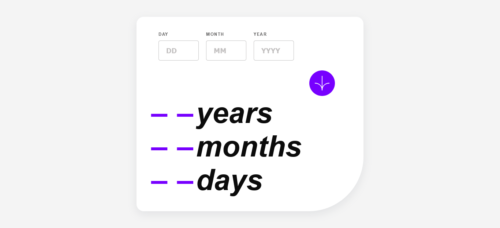
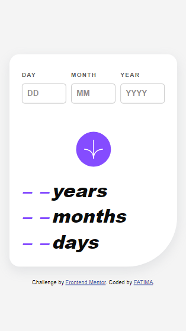

# Age-calculator-app

This is a solution to the [Age calculator app challenge on Frontend Mentor](https://www.frontendmentor.io/challenges/age-calculator-app-dF9DFFpj-Q). Frontend Mentor challenges help you improve your coding skills by building realistic projects. 

## Table of contents

- [Overview](#overview)
  - [The challenge](#the-challenge)
  - [Screenshot](#screenshot)
  - [Links](#links)
- [My process](#my-process)
  - [Built with](#built-with)
  - [What I learned](#what-i-learned)
  - [Continued development](#continued-development)
  - [Useful resources](#useful-resources)
- [Author](#author)
- [Acknowledgments](#acknowledgments)

**Note: Delete this note and update the table of contents based on what sections you keep.**

## Overview

### The challenge

Users should be able to:

- View an age in years, months, and days after submitting a valid date through the form
- Receive validation errors if:
  - Any field is empty when the form is submitted
  - The day number is not between 1-31
  - The month number is not between 1-12
  - The year is in the future
  - The date is invalid e.g. 31/04/1991 (there are 30 days in April)
- View the optimal layout for the interface depending on their device's screen size
- See hover and focus states for all interactive elements on the page
- **Bonus**: See the age numbers animate to their final number when the form is submitted

### Screenshot




### Links

- Solution URL: [Add solution URL here](https://your-solution-url.com)
- Live Site URL: [Add live site URL here](https://your-live-site-url.com)

## My process

### Built with

- HTML5
- CSS custom properties
- CSS Flexbox
- JavaScript for DOM manipulation and form validation
- Mobile-first workflow
- Poppins Font

### What I learned

While working on this project, I improved my skills in form validation, responsive design, and JavaScript date manipulation. Below are some code snippets I'm particularly proud of:


```html
This snippet demonstrates the clear structure of the form inputs and labels, making the form more accessible and user-friendly.

<div class="input-group">
      <div class="input-container">
        <label for="day">DAY</label>
        <input type="text" id="day" placeholder="DD">
        <span class="error-message" id="dayerror"></span>
      </div>

      <div class="input-container">
        <label for="month">MONTH</label>
        <input type="text" id="month" placeholder="MM">
        <span class="error-message" id="montherror"></span>
      </div>

      <div class="input-container">
        <label for="year">YEAR</label>
        <input type="text" id="year" placeholder="YYYY">
        <span class="error-message" id="yearerror"></span>
      </div>
    </div>
```
```css
This part of the CSS handles responsiveness, ensuring that the layout adjusts properly for mobile devices.

    @media (max-width: 400px) {
      .container {
        width: 100%;
        margin: 15px;
        padding: 25px;
      }

      .input-container,
      button {
        margin: 10px 0;
      }

      .resultText,#blanks {
        font-size: 2.3em;
        white-space: nowrap;
        font-weight: 900;
      }
    }

```
```js
let ageYears = today.getFullYear() - birthDate.getFullYear();
let ageMonths = today.getMonth() - birthDate.getMonth();
let ageDays = today.getDate() - birthDate.getDate();

if (ageDays < 0) {
  ageMonths--;
  ageDays += new Date(today.getFullYear(), today.getMonth(), 0).getDate();
}
if (ageMonths < 0) {
  ageYears--;
  ageMonths += 12;
}

```
Additionally, I enjoyed learning how to create responsive layouts using Flexbox and media queries to adapt the design for mobile devices.

### Continued development

In future projects, I aim to:

- Improve accessibility by adding ARIA attributes and ensuring keyboard navigation.
- Further explore form validation using libraries like Yup or Formik in React.
- Enhance animations for a smoother user experience.

### Useful resources

- [MDN Web Docs - Form Validation](https://developer.mozilla.org/en-US/docs/Learn/Forms/Form_validation) - This helped me grasp native form validation techniques and patterns.
- [CSS Tricks - Responsive Design](https://css-tricks.com/snippets/css/a-guide-to-flexbox/) - A great guide to understanding responsive layouts using Flexbox.

## Author

- Frontend Mentor - [@Fatima101](https://www.frontendmentor.io/Fatimaa101/Fatimaa101)

## Acknowledgments

This project was completed independently, but I would like to acknowledge the invaluable resources that supported my learning and development:

- MDN Web Docs for its in-depth documentation, especially on form validation techniques.
- CSS Tricks for their clear guides on responsive design, particularly the use of Flexbox.
- Stack Overflow for providing helpful solutions to various development questions.
